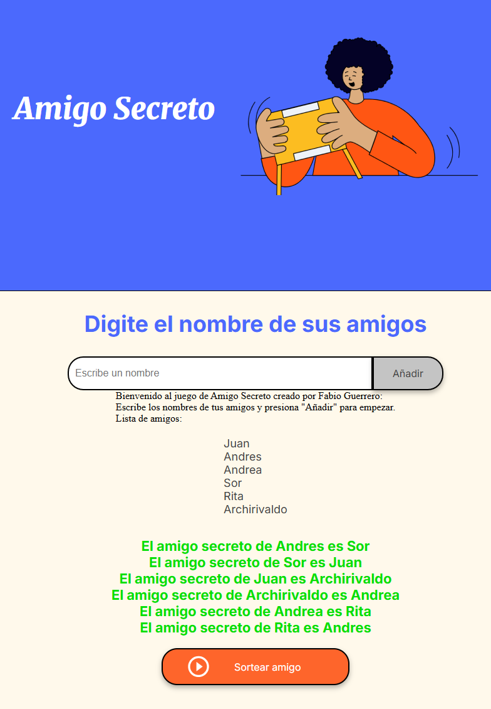

<h1>🎁 Amigo Secreto</h1>
Aplicación web simple para organizar un sorteo de Amigo Secreto. 
Permite añadir los nombres de los participantes, mostrarlos en pantalla y realizar un sorteo aleatorio para asignar quién regala a quién.

<h2>👨‍💻 Autor</h2>
Proyecto desarrollado por Fabio Guerrero.

<h2>🚀 Funcionalidades</h2>
- Ingresar nombres de amigos en una lista. 
- Mostrar todos los nombres añadidos. 
- Sortear de forma automática y aleatoria. 
- Mostrar los resultados en pantalla. 

<h2>🛠️ Tecnologías utilizadas</h2>
- HTML5 
- CSS 
- JavaScript 

<h2>📷 Vista previa</h2>

<h2>📦 Cómo usar</h2>
Clona este repositorio: 
- git clone https://github.com/FG-MEC/amigo-secretof.git 
- Abre el archivo index.html en tu navegador. 
- Digita los nombres en el campo de texto y pulsa Añadir. 
- Cuando todos los participantes estén añadidos, pulsa Sortear amigo. 

<h2>✨ Próximas mejoras</h2>
Permitir eliminar un nombre de la lista. 